# Web Store API App

## App Overview

This application is a backend-only app that simulates the API logic of a web store. It was developed using Node.js, Express and PostgreSQL. Postgres database runs on a local Docker container. RestAPI was used for sending requests to the server. Additional frameworks include Sequelize (ORM) and JSON Web Token for request authorization.

Below is presented the structure of the application in a graphical form.

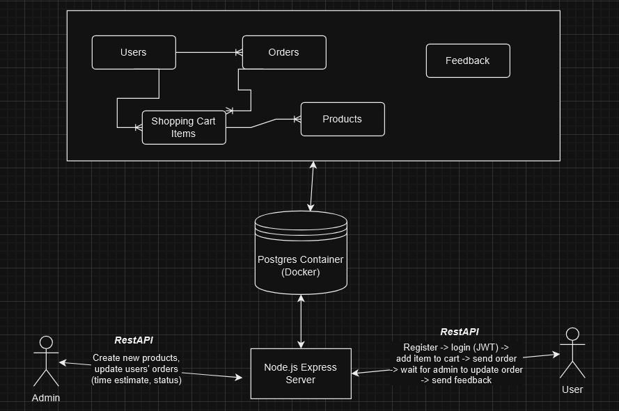

Here are some of the features of this application:

Store products

- They can be created by an admin and stored in a products table in the database
- Can be filtered by category

Authentication and auhtorization

- Passwords are hashed with bcrypt
- JWT access tokens are used for certain requests that require authorization (e.g. for viewing shopping cart items)

Shopping cart

- A product added to the cart creates a shopping cart item in the respective database table and it always has an user's ID so that user can view only their shopping cart items
- Items can also have a custom quantity, and the total price of one cart item is calculated based on its quantity and price

Orders

- When an user sends an order, an order object is created in the orders table, and the object has all the user's shopping cart items stored in an array
- Like shopping cart items, an order object always has a reference to the user's ID
- An order objects also contains a user's delivery details
- By default an order object has a status property set to "sent" and the time estimate for delivery is undefined, therefore the user must wait for the order to be updated by an admin

Admin/order management

- By default every user has role set to "user", admins however have the role set to "admin" (this can be done through SQL) so they have access to some protected routes
- Admins can create new products and update users' orders (status and time estimate)

Feedback

- Feedback can be sent anonymously (it doesn't require authentication or any user information), and the messages are stored in a database table

## How It Works

The PostgreSQL database runs on a Docker container.

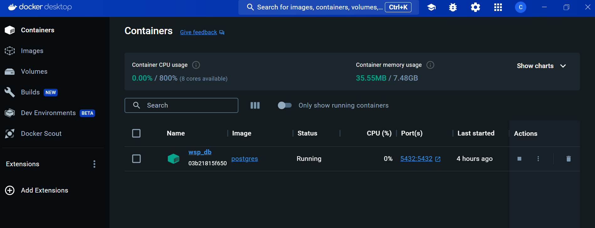

An user can be converted to an admin through SQL (note the username property is unique).

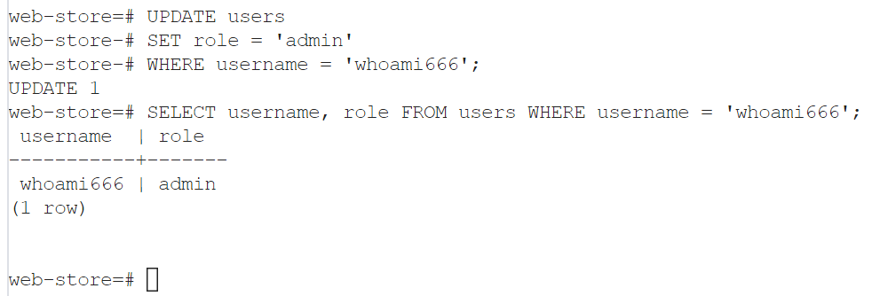

We start by authenticating into the server, we'll use an admin user for this example.

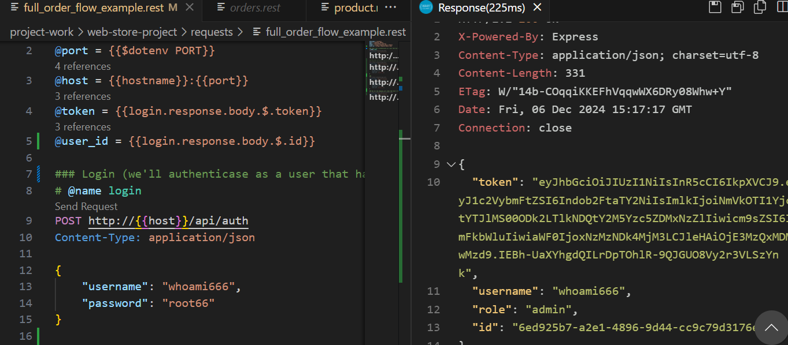

Products can be filtered by category (public route by the way).

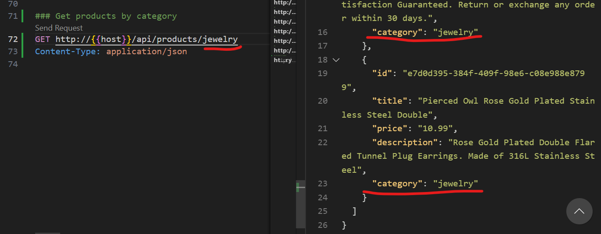

Next we can add some items to our shopping cart. Yes it is a bit sloppy to have to manually enter the data of a product like this. But in a frontend service, the properties of a fetched product would be most likely passed automatically into the request body through a mapped "Add To Cart" button, for example.

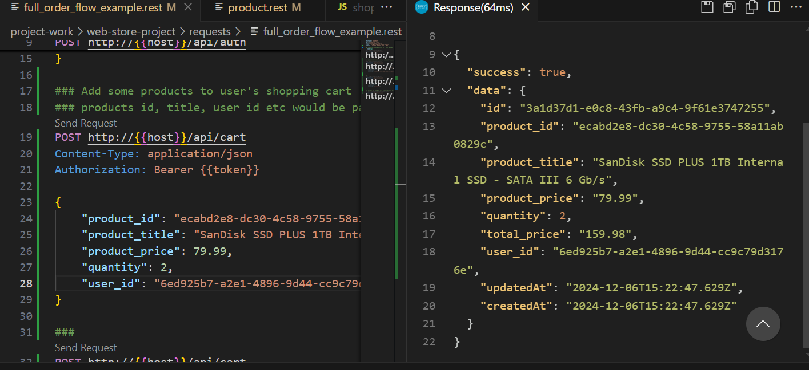

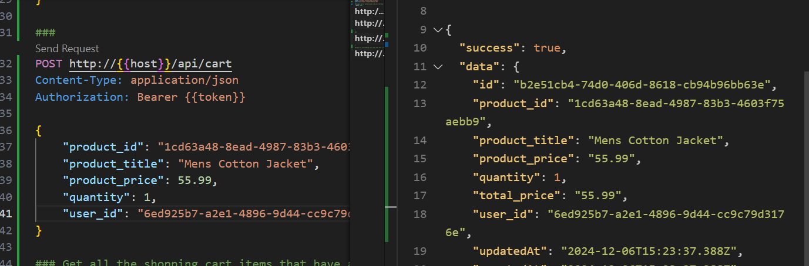

Here are the items in the database table. pgAdmin4 can be used to connect to the Dockerized Postgres database.

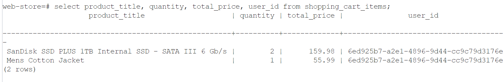

We can then view the products we have added to our shopping cart.Basically the query selects all the objects from the shopping cart items table that have a reference to our user's ID.

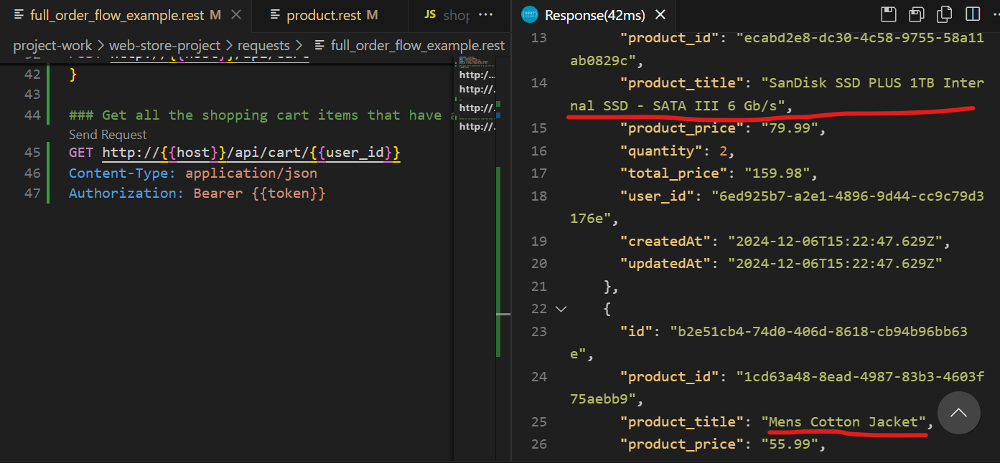

Then we can send the order. Our cart item names are passed to an array property in the order object. If we had multiple amount of one product, they are also duplicated in the array.

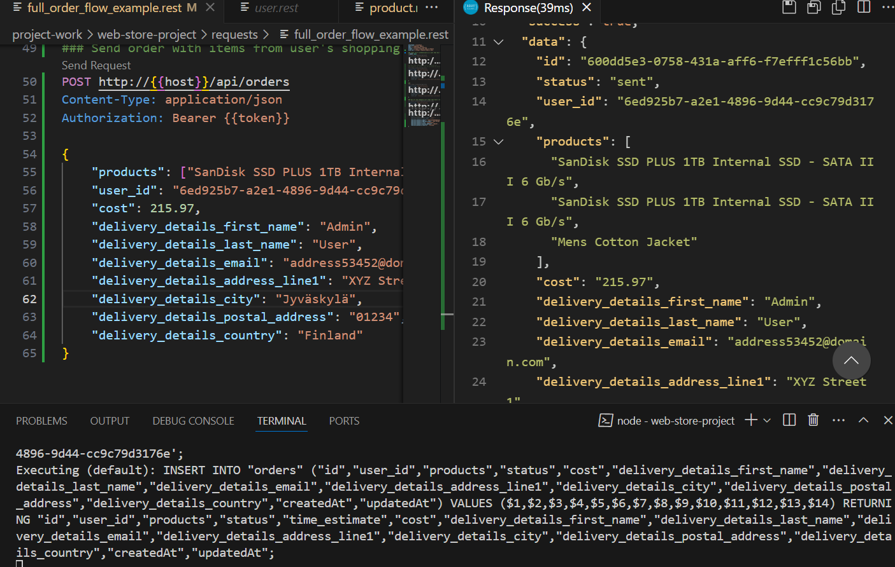

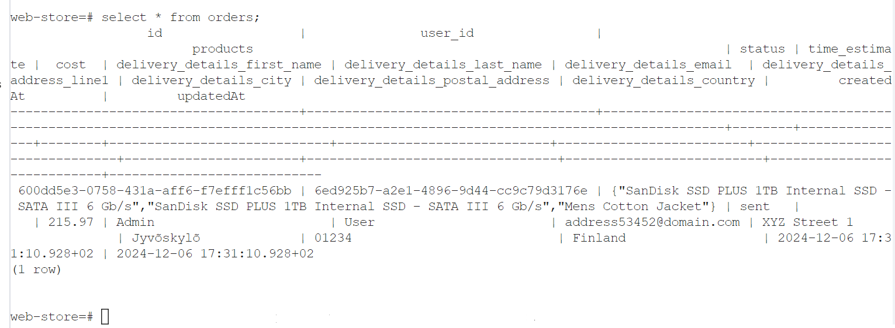

As an admin we can finally update an order's status and time estimate.

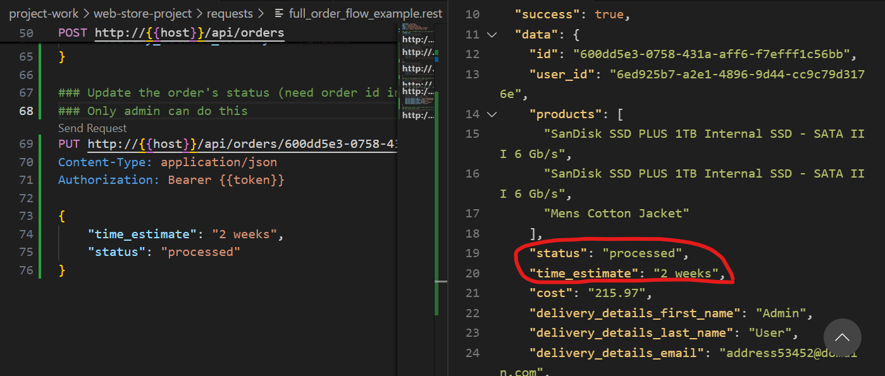

If we are satisfied with the service, we can send some feedback.

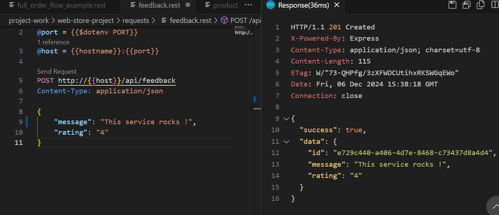

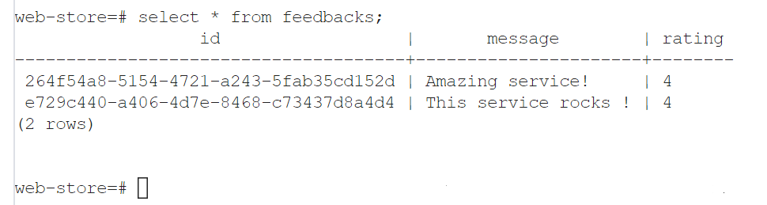
